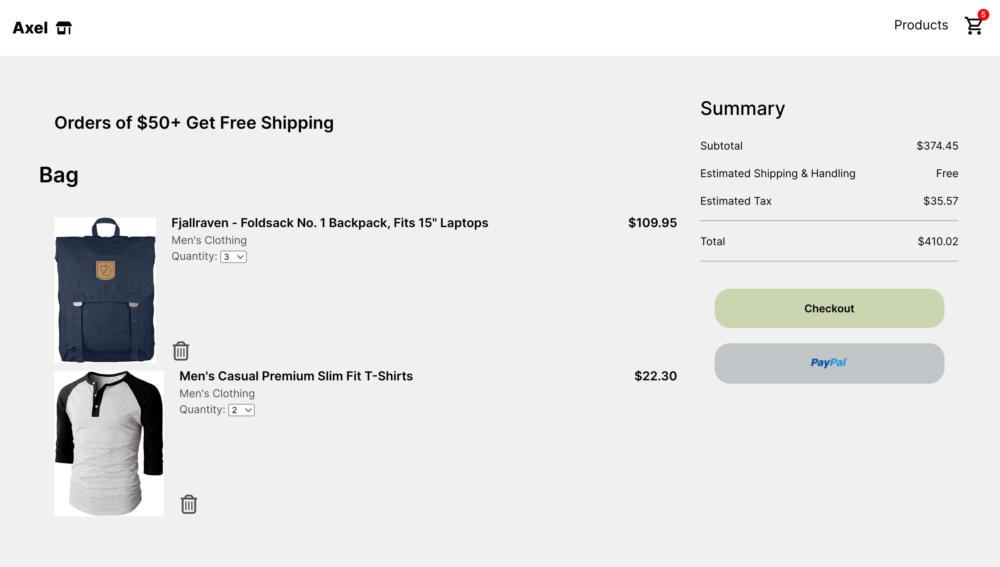

# Axel
This my front-end webpage for a mock store. I used fakestoreapi.com to get the data for the items to populate the store.
Axel allows users to browse through the catalog, add items to their cart, and edit/remove items from the cart.

Built this to practice learning more front-end :)

Tech Stack: React.js, Vite.js, HTML, CSS

